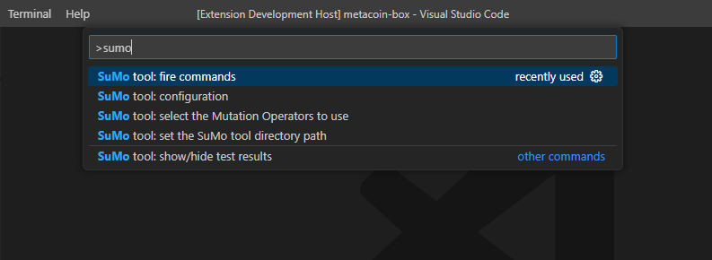
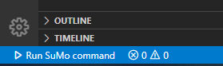
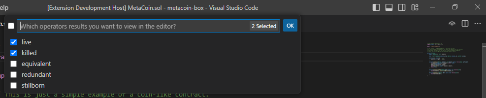
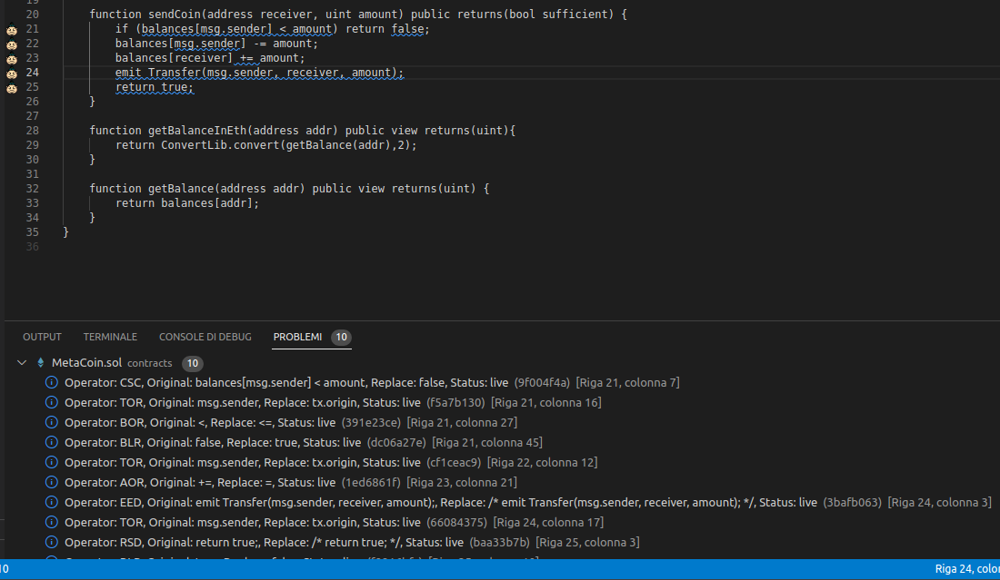

This set of instructions provides users with a basic understanding of how to use your Visual Studio Code extension for the SuMo tool.\
Once the project is open inside VS Code you can run the extension by doing the following:

# Requirements

1. [Visual Studio Code](https://code.visualstudio.com/)
2. [SuMo-SOlidity-MUtator](https://github.com/MorenaBarboni/SuMo-SOlidity-MUtator)

# Installation

Follow these steps to install the SuMo Extension for Visual Studio Code:

1. Open Visual Studio Code.
2. Click on the Extensions icon in the Activity Bar on the side of the window or use the (`Ctrl+Shift+X` or `Cmd+Shift+X` on Mac) keyboard shortcut to open the Extensions view.
3. Search for "SuMo Extension".
4. Click the Install button to install the SuMo Extension.
5. Click the Reload button to reload Visual Studio Code after the extension has been installed.
6. The SuMo Extension should now be installed and ready to use. 

# Getting started

Before using the SuMo Extension, you must install the [SuMo-SOlidity-MUtator](https://github.com/MorenaBarboni/SuMo-SOlidity-MUtator). Once you have installed SuMo, you can start using the SuMo Extension for Visual Studio Code:

## First run

1. (`Ctrl+Shift+P` or `Cmd+Shift+P` on Mac, from now `Command Palette`) and type `sumo path` to set the path where SuMo tool is installed inside your computer.
2. Open your Solidity project on Visual Studio Code.
3. Open the `Command Palette` and type `sumo config` to create a configuration for your project.
4. Open the `Command Palette` and type `sumo operators` to select the mutation operators to include on your tests.
5. Now the environment it's completly configured, so you can select the SuMo command to execute from the button in the lower left corner, or from the `Command Palette` and type `sumo commands`.

# Usage

In this section are illustrated more specificly all the possibile actions that this extension dispose to the user to interact with the SuMo tool.

The fondamental step to use the extension is to access all the commands that it provides to the user opening the `Command Palette` (`Ctrl+Shift+P` or `Cmd+Shift+P` on Mac, `View -> Command Palette...` from the Menu Bar of VS Code) than type `sumo` and the commands will be displayed as follow:

1. _configuration_: This command provides a webview to create/edit the configuration file to use to test the Solidity project. The user will be able to make necessary customizations to the configuration file, such as selecting the folders of the project build, contracts and tests; choose if skip some contracts or tests and set all the remaining parameters needed from SuMo.

2. _select the Mutation Operators to use_: This command provides a webview to enable or disable mutation operators for the SuMo tool. The user will be able to select the desired operators from a list, and the configuration file will be updated accordingly.

3. _fire commands_: This command allows the user to perform SuMo commands. The user will be prompted to select a command from a list of options, including "preflight", "mutate", "diff", "test", and "restore".\
The list of available SuMo commands is accessible also by clicking the lower left button `Run SuMo command`:

4. _show/hide test results_: This command enables or disables the visualization of SuMo test results. The user will be asked of choose which operators status of the results to be showed on the contract's editor. If no operator status is selected the visualization of test results will be disabled. The selection can be displayed also from the button with the `eye` icon in the top right corner of the window.

The desired mutation operators from the results will be shown inside the editor like this example, the line of code will be highligthed with a SuMo icon near the line number, the respective informations about the mutant are located inside the `Problem` panel, just below the code editor:
